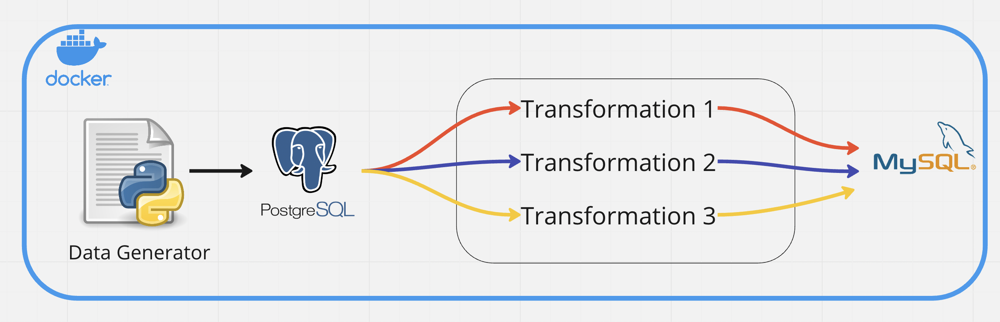
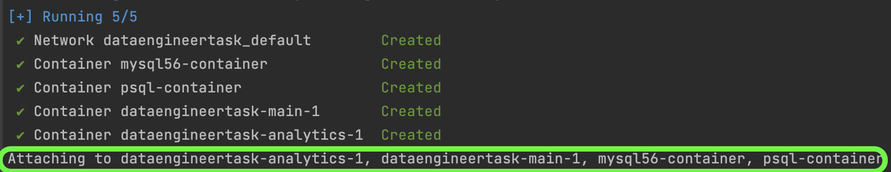
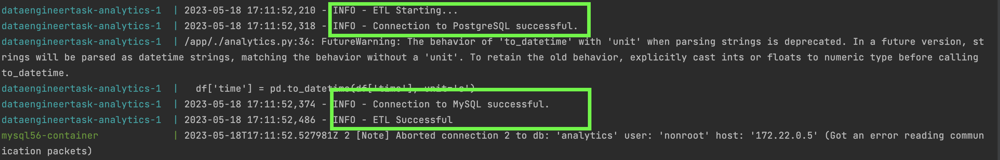
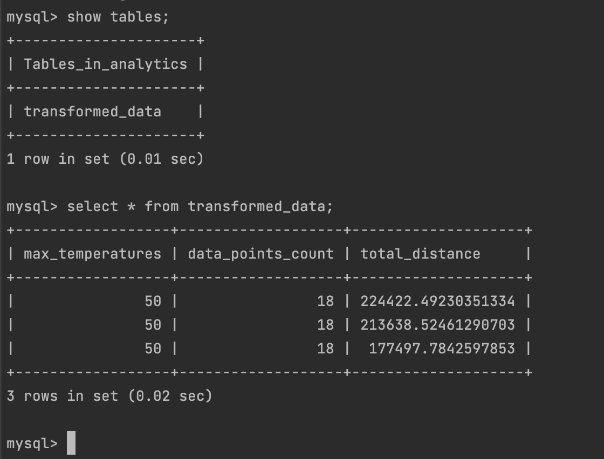

## Running the docker

To get started run ``` docker-compose up ``` in root directory.
It will create the PostgresSQL database and start generating the data.
It will create an empty MySQL database.
It will launch the analytics.py script. 

Your task will be to write the ETL script inside the analytics/analytics.py file.

## Architecture



# Data ETL Pipeline

This project implements an Extract-Transform-Load (ETL) pipeline to process and load data from PostgreSQL into MySQL. The pipeline performs data transformation tasks, including calculating maximum temperatures, data points count, and total distance of device movement per device per hour. The transformed data is then loaded into a single table in MySQL.

## Prerequisites

- Python 3.x
- PostgreSQL
- MySQL
- Docker

## Installation

1. Clone the repository:

   ```bash
   git clone https://github.com/mounicarajput/pair-data-engineering-task.git
   
2. Run Docker compose:

   ```bash
   docker-compose up --build
   
## Output

### Image building





### Setting up Postgresql, Mysql Connection  and Running ETL pipeline




### Transformed data into Mysql DB

a. The maximum temperatures measured for every device per hours.\
b. The amount of data points aggregated for every device per hours.\
c. Total distance of device movement for every device per hours.





### 🚀 Happy ETL-ing! 🚀